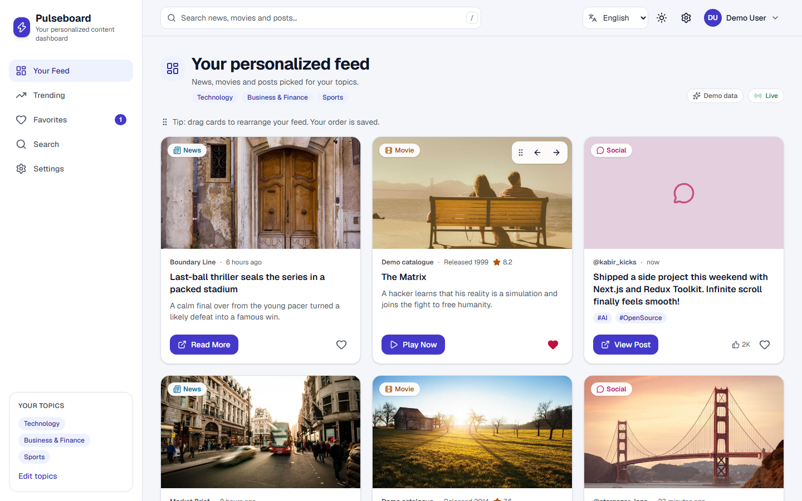
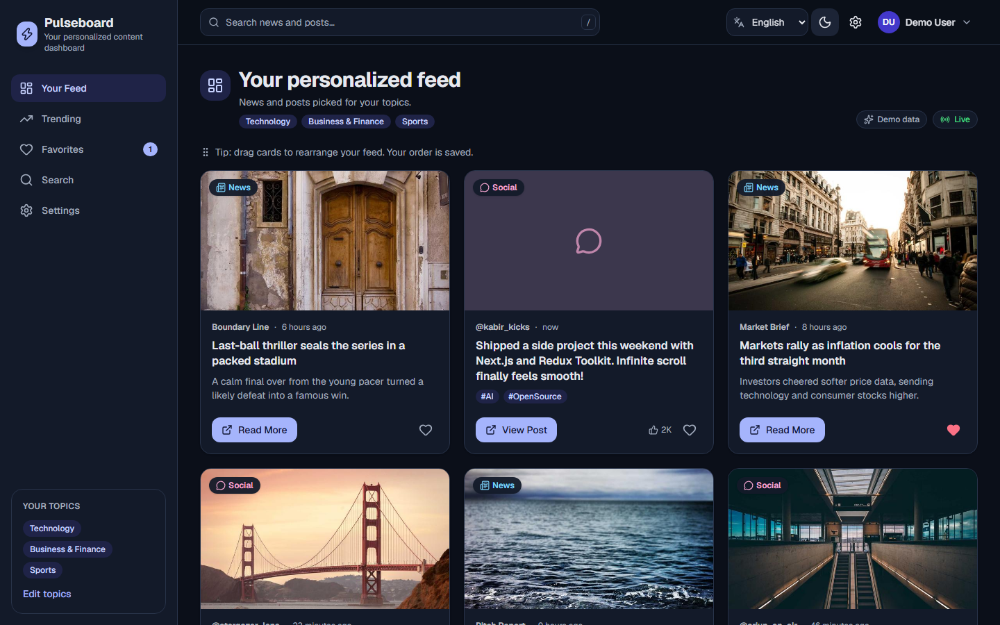
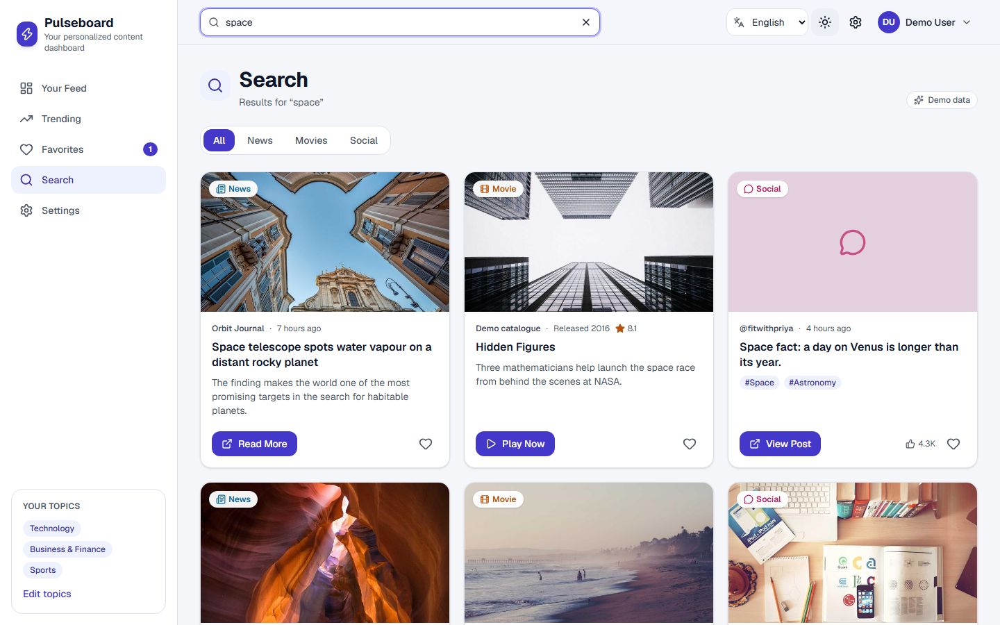
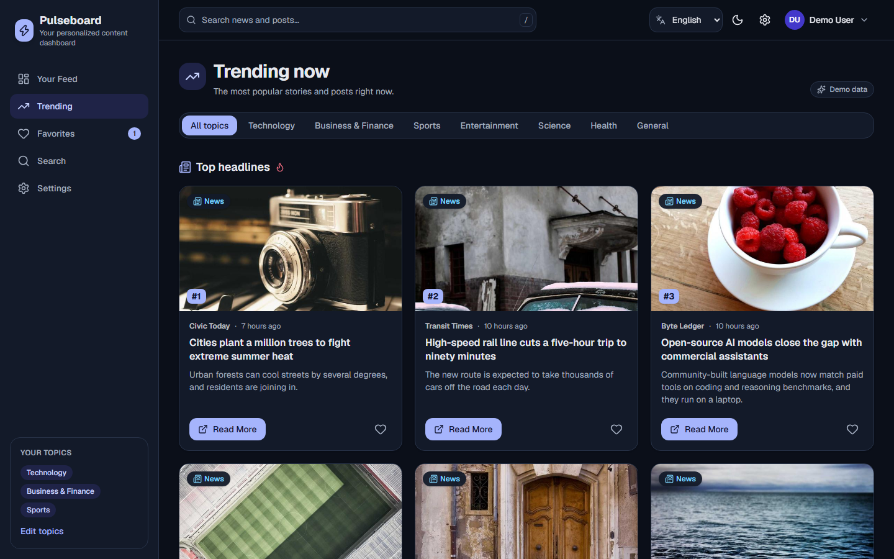
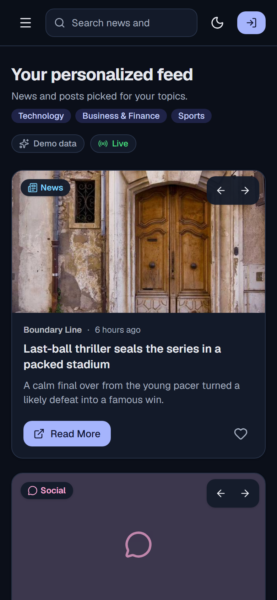
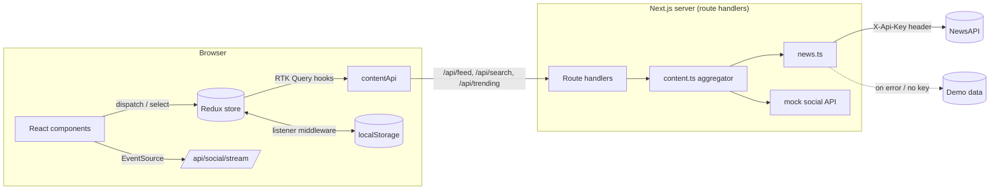

# Pulseboard: Personalized Content Dashboard

A dashboard that brings **news** and **social posts** into one feed you can customize. You pick your topics, search across every source, drag cards into your own order, save favorites, and switch between light/dark mode and three languages.

Built with **Next.js 16 (App Router)**, **React 19**, **TypeScript**, **Redux Toolkit + RTK Query**, **Tailwind CSS v4**, **Framer Motion** and **React DnD**. Tested with **Vitest**, **React Testing Library**, **MSW** and **Playwright**.

- **Demo video:** _add your video link here_



| Dark mode | Search across sources |
| --- | --- |
|  |  |

| Trending | Mobile |
| --- | --- |
|  |  |

---

## Contents

1. [Features](#features)
2. [Getting started](#getting-started)
3. [User flow](#user-flow)
4. [Architecture](#architecture)
5. [State management](#state-management)
6. [Performance](#performance)
7. [Accessibility](#accessibility)
8. [Security](#security)
9. [Testing](#testing)
10. [Production build](#production-build)
11. [Trade-offs and next steps](#trade-offs-and-next-steps)

---

## Features

### Core requirements

| Requirement | How it is implemented |
| --- | --- |
| **User preferences** | Settings page to pick favorite topics (Technology, Business & Finance, Sports, Entertainment, Science, Health, General) and which content sources appear. Stored in Redux and saved to `localStorage`. |
| **News API** | [NewsAPI](https://newsapi.org) top headlines for each selected topic, plus full-text search. |
| **Recommendations API** | **Not included.** TMDB is blocked on the developer's network, so it could not be built and tested. See [Trade-offs](#trade-offs-and-next-steps). |
| **Social media API** | A mock social API (allowed by the brief) that generates posts by hashtag and topic. |
| **Content cards** | Image, type badge, source, time, headline, description, and a call to action (**Read More** / **View Post**), plus a favorite button. Broken images fall back to a placeholder. |
| **Infinite scrolling** | The feed and search results load the next page when you near the bottom (IntersectionObserver). A visible **Load more** button is kept as a fallback. |
| **Dashboard layout** | Responsive layout: fixed sidebar on desktop, slide-in drawer on mobile. Sticky header with search, language picker, theme toggle, settings and account menu. |
| **Personalized feed** | News and social posts mixed into one unified feed. |
| **Trending section** | Top headlines and the most-liked posts, filterable by topic and ranked #1–#6. |
| **Favorites section** | Heart any card to save it. Favorites persist, can be filtered by type, and can be cleared. |
| **Search** | Header search across news and social posts, filterable by type. |
| **Debounced search** | Keystrokes update the input instantly, but the query is committed (and the API called) only after 400 ms without typing. Enter searches immediately. |
| **Drag and drop** | Reorder feed cards with **React DnD**. **Framer Motion** animates them into place, and the order is saved. Each card also has **Move earlier / Move later** buttons so reordering works with a keyboard or a touch screen. |
| **Dark mode** | Colour tokens are **CSS custom properties** consumed by **Tailwind** utilities. An inline script applies the saved or OS theme before first paint, so there is no flash. |
| **Animations** | Section transitions, card hover lift, skeleton loaders, spinners, animated filter tabs, drawer and menu transitions. All of them respect `prefers-reduced-motion`. |
| **Redux Toolkit** | Slices for preferences, favorites (entity adapter), feed order, auth, search and UI state. |
| **Async logic** | **RTK Query** (including infinite queries) for every API call, with caching and request de-duplication. |
| **Persistence** | A listener middleware saves preferences, favorites, feed order and profile to `localStorage`. Saves are debounced, flushed on page hide, and validated when loaded. |
| **Testing** | 108 unit and integration tests (Vitest + RTL + MSW) and 15 Playwright E2E tests. |

### Bonus features

| Bonus | Implementation |
| --- | --- |
| **Authentication** | Mock sign-in / sign-up with form validation and a one-click demo account. You can edit your profile (name, bio, avatar colour). |
| **Real-time data** | A **Server-Sent Events** stream (`/api/social/stream`) pushes new social posts. A "3 new posts · Show" banner lets the user choose when to add them, so the feed never jumps. |
| **Multi-language** | **react-i18next** with English, Hindi and Spanish. Translation keys are type-checked. |

Extras: a "Demo data" badge whenever bundled fallback content is shown, a `/` keyboard shortcut to focus search, screen-reader announcements when a card moves, security headers, and a CI pipeline.

---

## Getting started

### Prerequisites

- **Node.js 20.9 or newer** (developed on Node 24)
- npm

### 1. Install

```bash
git clone https://github.com/VaibhavInAction/assiment.git
cd assiment
npm install
```

### 2. Add a NewsAPI key (optional, but recommended)

The app **works without a key**: news falls back to bundled demo data. To see live news:

```bash
cp .env.example .env.local
```

Then fill in `.env.local`:

| Variable | Where to get it |
| --- | --- |
| `NEWS_API_KEY` | Free key at <https://newsapi.org/register> |
| `USE_MOCK_DATA` | Optional. Set to `true` to force demo data everywhere. |

These variables are read **only on the server**. They are never prefixed with `NEXT_PUBLIC_` and never reach the browser.

### 3. Run

```bash
npm run dev
```

Open <http://localhost:3000>.

### Scripts

| Command | What it does |
| --- | --- |
| `npm run dev` | Start the development server |
| `npm run build` / `npm start` | Production build / serve it |
| `npm run lint` | ESLint (Next.js core-web-vitals + TypeScript rules) |
| `npm run typecheck` | Generate route types and run `tsc --noEmit` |
| `npm test` | Unit + integration tests (Vitest) |
| `npm run test:coverage` | Same, with a coverage report |
| `npm run test:e2e` | Playwright E2E tests (builds the app and starts it in demo mode automatically) |
| `npm run test:all` | Lint, typecheck, unit/integration and E2E tests |

> First E2E run only: `npx playwright install chromium`

---

## User flow

1. **Land on "Your Feed".** Skeleton cards show while saved preferences load from `localStorage`. The feed is then fetched once, already personalized (it never fetches defaults first and then refetches).
2. **Browse.** Each card is a news story (**Read More**) or a social post (**View Post**, with hashtags and likes). Scrolling down loads more automatically.
3. **Personalize.** Open **Settings** (sidebar, header gear or *Edit topics*). Choose topics and sources, toggle dark mode, switch language, turn live updates on or off. Changes apply instantly and are saved.
4. **Organize.** Drag a card onto another card to move it there, or use the arrow buttons on a card. The order survives reloads. **Reset order** restores the natural order.
5. **Save favorites.** Tap the heart on any card. The **Favorites** page lists everything saved, newest first, filterable by type.
6. **Search.** Type in the header search (or press `/`). After a short pause the app opens **Search** with results from all sources. Filter by News or Social. `Esc` clears.
7. **Trending.** See top headlines and the hottest posts, by topic.
8. **Live posts.** While on the feed, new posts stream in over SSE. A banner shows how many are waiting, and one click adds them to the top.
9. **Sign in (mock).** Use **Sign in** in the header with any email and a 6+ character password, or **Continue with demo account**. Your name and avatar appear in the header, and you can edit your profile in Settings.

---

## Architecture



**Why route handlers?** The browser never talks to NewsAPI directly. Our own `/api/*` endpoints:

- keep API keys secret (server-only env vars, guarded by the `server-only` package),
- normalize every source into one `ContentItem` shape,
- validate and clamp all query parameters,
- cache upstream responses for 15 minutes to protect free-tier quotas,
- fall back to demo data per source, so a NewsAPI outage never breaks the social feed or the page.

### Project structure

```
src/
├── app/
│   ├── (dashboard)/          # Feed, trending, favorites, search, settings (shared layout + page transition template)
│   ├── api/                  # Route handlers: feed, search, trending, social/stream (SSE)
│   ├── login/                # Mock auth page
│   ├── layout.tsx            # Root layout, fonts, no-flash theme script
│   └── providers.tsx         # Redux provider, hydration from storage, theme/language sync
├── components/
│   ├── content/              # ContentCard, SortableFeedGrid (React DnD), ContentGrid, LoadMore
│   ├── layout/               # AppShell, Sidebar, Header, SearchBar, ThemeToggle, UserMenu, LanguageSelect
│   ├── sections/             # One component per page (FeedSection, SearchSection, ...)
│   └── ui/                   # Small building blocks: Switch, FilterTabs, skeletons, empty/error states
├── hooks/                    # useDebouncedValue, useInfiniteScroll, useLiveSocialFeed
├── lib/
│   ├── server/               # Server-only API clients, aggregation, parameter parsing
│   ├── mock/                 # Deterministic demo data + mock social API
│   ├── i18n/                 # i18next setup and en / hi / es translations
│   ├── feedOrder.ts          # Pure drag-and-drop ordering logic
│   └── types.ts              # Shared types and runtime guards
├── store/
│   ├── api/contentApi.ts     # RTK Query endpoints
│   ├── slices/               # preferences, favorites, feed, auth, search, ui
│   ├── persistence.ts        # Load/validate/save localStorage state
│   └── index.ts              # Store factory + persistence listener
└── test/                     # Test setup, MSW server, render helpers, fixtures
e2e/                          # Playwright specs
```

---

## State management

| Slice | Holds | Persisted |
| --- | --- | --- |
| `preferences` | topics, theme, language, enabled sources, live updates | ✅ |
| `favorites` | saved items (normalized with `createEntityAdapter`, newest first) | ✅ |
| `feed` | drag-and-drop order, live posts | order only |
| `auth` | mock user profile (never a password) | ✅ |
| `search` | committed (debounced) query and type filter | — |
| `ui` | `hydrated` flag | — |
| `contentApi` | RTK Query cache for feed, search and trending | — |

**Hydration without mismatches.** The server always renders defaults. After mount, `Providers` dispatches a single `hydrateFromStorage` action that every slice handles. Data fetching waits for that flag (`skipToken`), so the first request already uses the user's topics. Writes are blocked until hydration, so defaults can never overwrite saved data.

**Drag-and-drop ordering.** `applyCustomOrder` (in `lib/feedOrder.ts`) re-applies the saved order to freshly fetched pages. Cards the user has arranged keep their relative order. New cards (the next page, a live post) stay where they naturally appear instead of jumping to the end.

---

## Performance

- **Debounced search** (400 ms) means one request per pause, not one per keystroke. An E2E test asserts exactly one request for a typed word.
- **Pagination / infinite scroll** with RTK Query infinite queries. The server caps pages (`MAX_PAGES = 10`).
- **Caching at two layers**: RTK Query keeps results for 5 minutes, so switching sections is instant. The server caches upstream responses for 15 minutes.
- **Parallel upstream requests** (`Promise.all`) per feed page.
- Memoized cards (`React.memo`) and selectors (`createSelector`). Lazy-loaded, async-decoded images.
- No fetch before preferences are known, so there is never a wasted "default" request.

## Accessibility

Built to WCAG 2.1 AA:

- Semantic landmarks (`header`, `nav`, `main`), a **skip to content** link, and `aria-current` on the active nav item.
- Everything works with a keyboard: drag-and-drop has **Move earlier / Move later** buttons, and moves are announced to screen readers.
- Toggle states use `aria-pressed` / `role="switch"`. Form errors use `aria-invalid` + `aria-describedby`, and focus moves to the first invalid field.
- Colour tokens are chosen for 4.5:1 text contrast in both themes. Visible focus rings throughout.
- Animations respect `prefers-reduced-motion` (Framer Motion `MotionConfig` + CSS).
- `lang` on `<html>` follows the selected language.

## Security

- **API keys stay on the server.** Third-party calls happen only in route handlers. NewsAPI keys are sent in a header (not the URL), and logs never print upstream URLs.
- `.env.local` is git-ignored. Only `.env.example` (empty values) is committed.
- **All input is validated server-side**: categories and types are allow-listed, pages are clamped, and query length is capped.
- **localStorage is treated as untrusted.** Everything read back is validated (`sanitizePersistedState`), including the avatar colour, since it is used in a `style` attribute.
- External links use `rel="noopener noreferrer"`. Article URLs and image URLs must be `http(s)`.
- Security headers: `X-Content-Type-Options`, `X-Frame-Options: DENY`, `Referrer-Policy`, `Permissions-Policy`. `X-Powered-By` is disabled.
- Mock auth never stores passwords. In production this would be **NextAuth.js** with httpOnly session cookies (see next steps).

---

## Testing

```bash
npm test               # 108 unit + integration tests
npm run test:coverage  # with coverage (~76% statements; E2E covers the rest of the UI)
npm run test:e2e       # 15 Playwright tests
```

**Unit tests**: ordering logic, utilities, request parsing, the mock social API, the NewsAPI client (key sent as a header, fallback on 429), content aggregation, every Redux slice, persistence (corrupted JSON, invalid values, no write before hydration, debouncing) and the debounce hook.

**Integration tests** (RTL + MSW, real store and real RTK Query):

- feed waits for preferences, then requests the right topics and sources
- loading, **empty**, **error + retry**, pagination, the demo-data badge
- keyboard reordering, restoring a saved order, reset
- search results, type filter refetch, no results, API error
- favorites, settings, profile editing, login validation, route handlers

**E2E tests** (Playwright, against a production build with `USE_MOCK_DATA=true` so they are deterministic and use no API quota):

- **Search**: debounced (asserts a single request), filters, empty state, `/` and `Esc`
- **Drag and drop**: a real mouse drag reorders cards, the order survives reload, reset, keyboard reordering
- **User authentication**: validation, sign in, session survives reload, sign out, demo account
- Favorites, navigation, settings-driven personalization, dark mode persistence, Hindi translation, mobile drawer

CI (`.github/workflows/ci.yml`) runs lint, typecheck, unit tests with coverage, and E2E on every push and pull request.

---

## Production build

To run the optimized production version locally:

```bash
npm run build
npm start
```

Then open <http://localhost:3000>. The `NEWS_API_KEY` from `.env.local` is used here too.

> **Note on NewsAPI's free plan:** it allows 100 requests a day. If the limit is reached, news automatically falls back to demo data and a "Demo data" badge appears. Nothing breaks.

---

## Trade-offs and next steps

- **No recommendations API (movies or music).** TMDB was the planned source, but the developer's internet provider blocks `themoviedb.org` at the DNS level. The site and API time out, so a key could not be obtained or tested. Rather than ship untested code, the movie source was removed. The feed aggregator is source-agnostic: adding a recommendations source means one server module in `lib/server/` and one new `ContentType`, and the cards, search, favorites and filters pick it up automatically.
- **Social media** is a mock API. Real Twitter/X and Instagram APIs require paid or app-review access. The mock follows the same `ContentItem` contract, so swapping in a real client only touches `lib/mock/social.ts`.
- **Authentication** is mocked on the client. Next step: NextAuth.js with OAuth providers and server-side sessions, moving favorites and preferences to a database so they sync across devices.
- **Drag and drop** uses the HTML5 backend, which does not support touch dragging. Touch users get the move buttons. A multi-backend (HTML5 + touch) would add touch dragging.
- **Live posts** use SSE, which is simple and works on serverless. The stream closes after 4 minutes and the browser reconnects automatically. WebSockets would be the choice for two-way features (comments, presence).
- With more time: virtualized feed rendering for very long sessions, offline support with a service worker, and visual regression tests.
